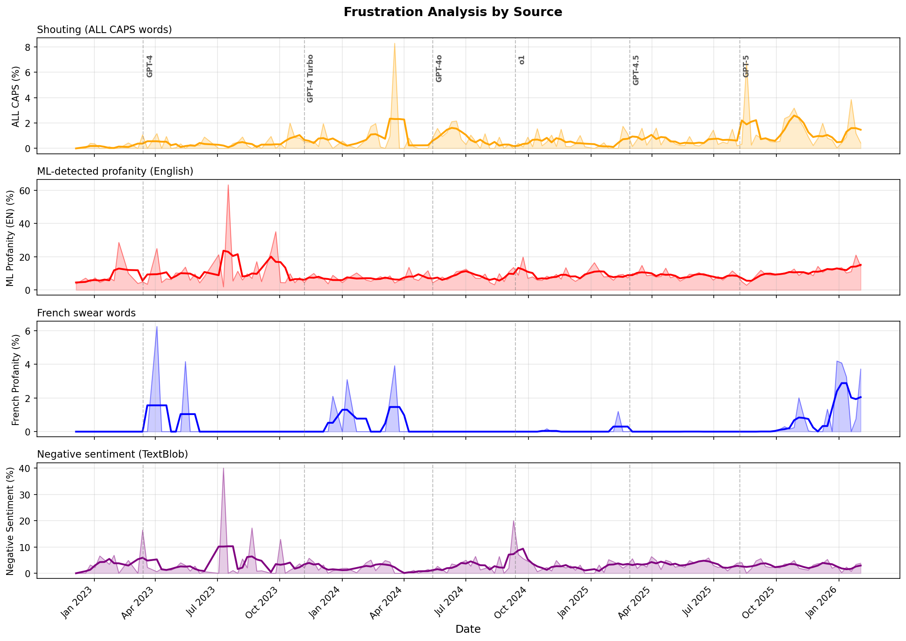
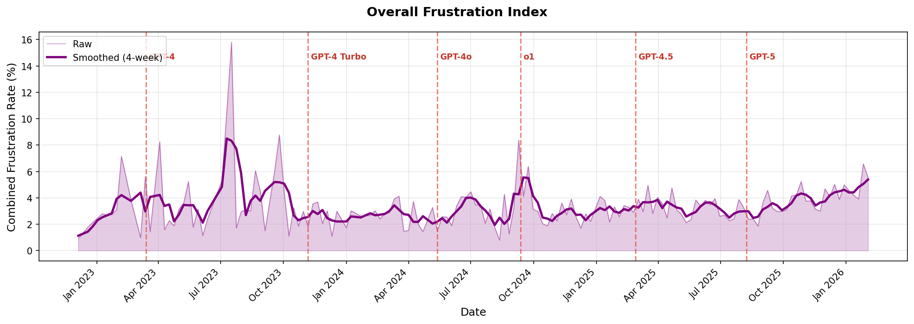

# ChatGPT Frustration Analyzer

A Python tool that analyzes user frustration levels in ChatGPT conversation exports over time, using ML-based detection methods.

## What It Does

This tool processes your ChatGPT conversation export (`conversations.json`) and measures frustration indicators in your messages:

1. **ALL CAPS Detection** - Counts words written in ALL CAPS (excluding common acronyms like API, URL, JSON)
2. **ML Profanity Detection** - Uses machine learning to detect English profanity (`alt-profanity-check`)
3. **French Profanity** - Word-based detection for French swear words
4. **Sentiment Analysis** - Measures negative sentiment using TextBlob

The script aggregates data by week and produces visualizations showing frustration trends over time, with annotations for major GPT model releases.

## Usage

```bash
python frustration_analyzer.py [conversations.json] [output.png]
```

Both arguments are optional and default to `conversations.json` and `frustration_plot.png`.

## Output

The script generates two plots:

### 1. Frustration by Source (`frustration_sources.png`)
Four subplots showing each frustration indicator separately:
- Shouting (ALL CAPS words)
- ML-detected profanity (English)
- French swear words
- Negative sentiment



### 2. Combined Frustration Index (`frustration_combined.png`)
A single plot showing the overall frustration index (weighted average of all sources) with 4-week smoothing.



## Results

The analysis covers conversation data from late 2022 through early 2026, with vertical lines marking major model releases (GPT-4, GPT-4 Turbo, GPT-4o, o1, GPT-4.5, GPT-5).

Key observations:
- **Peak frustration** occurred around July 2023, shortly after GPT-4's initial release
- **ML profanity scores** show the highest spikes, reaching ~60% during the July 2023 peak
- **Sentiment analysis** reveals elevated negativity in the early GPT-4 era
- **Overall trend** shows frustration stabilizing at lower levels (~3-5%) in 2024-2025
- Minor upticks visible around new model releases

## Data Preprocessing

The analyzer filters out code and technical content before analysis:
- Removes markdown code blocks and inline code
- Filters out URLs
- Excludes lines with code indicators (imports, function definitions, etc.)
- Skips lines with high density of special characters

## License

MIT
